

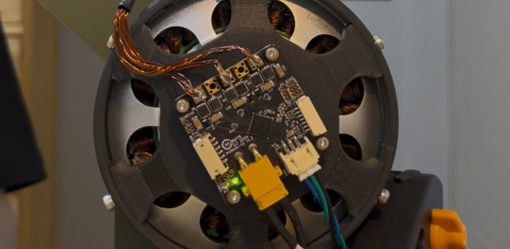

<iframe width="560" height="315" src="https://www.youtube.com/embed/m4KiFf9MHiw" title="YouTube video player" frameborder="0" allow="accelerometer; autoplay; clipboard-write; encrypted-media; gyroscope; picture-in-picture; web-share" referrerpolicy="strict-origin-when-cross-origin" allowfullscreen></iframe>

---
## Background: Motivation and Evolution
This Project builds upon my previous project project, 'A Low-Cost 3D-Printed Proprioceptive Actuator for HRI', and represents a significant step forward in performance and design.

In the ealier actuators(v1, v2 and v3), these exhibited insufficient torque density, which limited their application in dynamic and agile robotic systems. The primary cause was the use of small size off-the-shelf BLDC drone motors; their small air-gap radius and small torque-density could not generate the necessary torque. 

To address this problem, I initiated this project, focusing on maximizing torque density, compactness and system efficiecy. By adopting a large-diameter "pancake" BLDC motor to maximize the air-gap radius for high torque density and integrating a internal cycloidal reducer for compactness, I enhenced the actuator's dynamics and agility. Inspired by the MIT Mini Cheetah's design philosophy, this project demonstrates a transition toward a more robust and high-performance Quasi-Direct Drive (QDD) system.

---

## 1. Abstract
Rapid advancements in dynamic humanoid and quadruped robots have surged recently. However, high-performance actuators remain largely proprietary, restricting access for academic researchers and open-source communities. This project aims to democratize dynamic robotics by developing an open-source Quasi-Direct Drive (QDD) actuator tailored for dynamic robots

Traditional high-ratio gearboxes suffer from poor back-drivability, low responsiveness and limited transmission transparency, making them unsuitable for safe Human-Robot Interaction (HRI) and uneven terrain locomotion. To address this, I propose a custom-designed QDD actuator featuring a 10:1 cycloidal reducer. This low-reduction design minimizes mechanical impedance, enabling back-drivable, high responsiveness and proprioceptive torque sensing via FOC algorithms without additional sensors.

The current prototype utilizes a 3D-printed and aluminium structure to ensure low cost and accessibility. And the performance of my actuator; Maximum Torque: 8.8Nm, Maximum Velocity: 22rad/s and Nominal Velocity 12.6rad/s under 24V. I want this project contributes to the robotic community by providing a scalable, affordable, and the actuation solution.

<table>
    <tr>
      <td>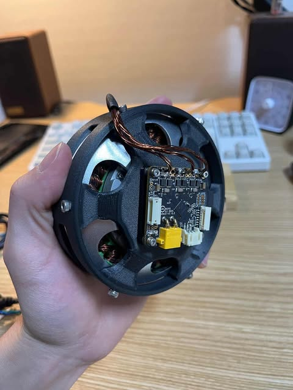</td>
      <td>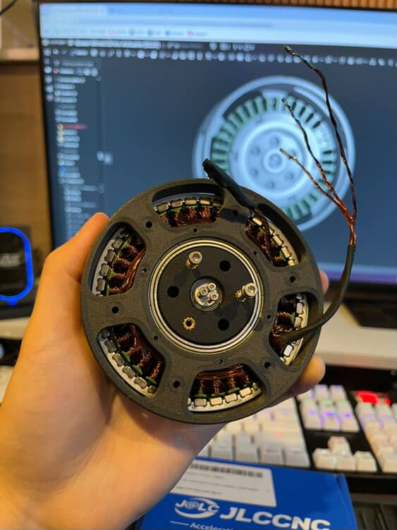</td>
    </tr>
  </table>

---

## 2. Actuator Design: Why QDD Actuator?

### 2.1 The Limitations of Traditional Actuators

**Conventional robotic actuators** typically utilize high gear reduction ratios (e.g., 1:100 or higher) to amplify torque. However, this approach introduces significant drawbacks for dynamic robots.

A high gear ratio leads to **high mechanical impedance**, primarily due to increased friction and reflected inertia compared to low-ratio systems [[1]](#8-references).

This high mechanical impedance makes the motor response sluggish and susceptible to damage from sudden external impacts, as the actuators are too stiff to react compliantly. In other words, the actuator exhibits **poor back-drivability and low responsiveness** [[2]](#8-references). Consequently, these properties hinder the robot's ability to interact safely with the environment, particularly in Human-Robot Interaction (HRI) scenarios or during dynamic locomotion.

As robots become more integrated into our daily lives, physical interaction and cooperation will become increasingly common. In these scenarios, traditional actuators pose a significant safety risk. Since robots with stiff actuators struggle to sense external forces [[3]](#8-references), they can unintentionally injure people due to their lack of compliance. Furthermore, regarding locomotion, such robots cannot flexibly adapt to unpredictable environments, such as rough or uneven terrain, leading to instability. 

Additionally, the complex dynamics & mechanical impedance of such actuators make them difficult to model accurately in physical simulators, creating a significant Sim-to-Real gap. Such modeling inaccuracies often lead to the failure of hardware deployment, particularly when using policies trained via Reinforcement Learning [[4]](#8-references).

### 2.2 The QDD System Solution
To address these issues, I adopted a **Quasi-Direct Drive (QDD) architecture**. A QDD system typically features a low gear reduction ratio, ranging from 3:1 to 10:1. By positioning itself between Direct Drive (1:1) and traditional high-ratio drives (1:50 or higher), it combines the structural advantages of both systems.

The low gear ratio significantly minimizes friction and reflected inertia, making the actuator **inherently compliant**. This compliance ensures the system is smoothly back-drivable and highly responsive to external interactions, effectively mitigating the stiffness drawbacks of conventional actuators.

Consequently, this **improved back-drivability and responsiveness** enable the robot to safely interact with humans and flexibly adapt to uneven terrain during dynamic locomotion.

**At this point, a critical question arises:** "How can the actuator generate sufficient torque for dynamic motions with such a low gear ratio?" The following section details the design strategy used to resolve this trade-off.

### 2.3 Motor Design Optimization
To achieve high torque density suitable for a Quasi-Direct Drive (QDD) system, I focused on the geometric parameters of the motor. According to the motor design principles outlined in the MIT Cheetah research, the continuous torque generation capability ($\tau$) is approximated by the following equation [[1], [5]](#8-references):

$$\tau \propto \sigma \cdot l_{st} \cdot r_g^2$$

Where:
* **$\sigma$**: Shear stress density (magnetic flux density $\times$ current loading)
* **$l_{st}$**: Stack length of the motor
* **$r_g$**: Air gap radius

As shown in the equation, torque is linearly proportional to the stack length ($l_{st}$) but proportional to the **square of the air gap radius ($r_g^2$)**. This implies that increasing the motor diameter is significantly more efficient for boosting torque than increasing its length. Based on this principle, I selected a stator with a large diameter (8110 size) to maximize the air gap radius, thereby securing sufficient torque even with a low gear reduction ratio. Furthermore, this large-diameter stator design provides a sufficient hollow center which can be utilized to embed the reducer gear, improving the compactness of the actuator and torque density.

### 2.4 Transmission Selection: Why Cycloidal Reducer?

In dynamic legged locomotion, the actuator must withstand high impact loads caused by ground reaction forces. While **Harmonic Drives** are industry standards for zero-backlash precision, their flexible spline mechanism is fragile under shock loads. And structurally, it's not suitable for low-ratio reducer.

Similarly, **Planetary Gearboxes**, though common, exhibit inherent backlash. It works well with aluminum gears, but becomes significantly fragile when 3D printed. In a 3D-printed planetary system, the stress concentrates on individual small gear teeth, making them prone to catastrophic failure under sudden external forces.

To ensure robustness, I selected a **Cycloidal Reducer** architecture. According to Sensinger's research, this mechanism distributes the load across multiple lobes simultaneously. This load-sharing capability provides significantly higher Shock Resistance compared to involute gears or fragile harmonic drives, making it the ideal candidate for a fully 3D-printed transmission [[6], [7], [8]](#8-references).

---

## 3. System Architecture & Components

### 3.1 Mechanical Design (Cycloidal Reducer)
A custom **Cycloidal Quasi-Direct Drive Actuator** is designed to ensure high torque density, compactness, and compliance.

I utilized Onshape 3D CAD to design a dual-disc cycloidal mechanism. The two cycloidal discs are arranged with a $180^\circ$ phase offset. This configuration effectively cancels out the radial forces and vibrations induced by the eccentric input shaft, ensuring smooth operation.

To maximize efficiency, I integrated rollers into the output pins. Unlike simple sliding contacts, these rollers minimize internal friction at the output stage, contributing to the system's back-drivability.

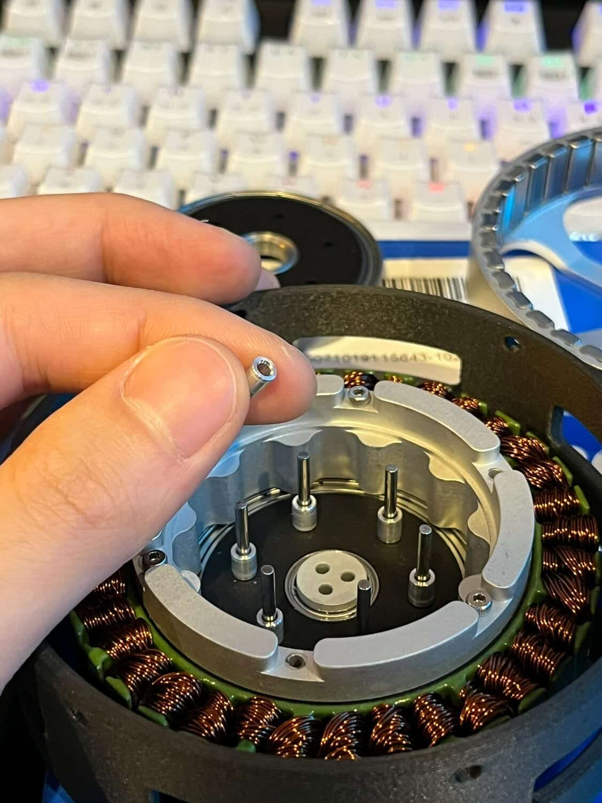

For the current prototype, the gears, shafts and rotor are manufactured from CNC-machined Aluminum to verify the design with a high strength-to-weight ratio. (Note: The final goal of this project is to optimize the design for a fully 3D-printed, low-cost actuator for dynamic robots.)

<table>
    <tr>
      <td>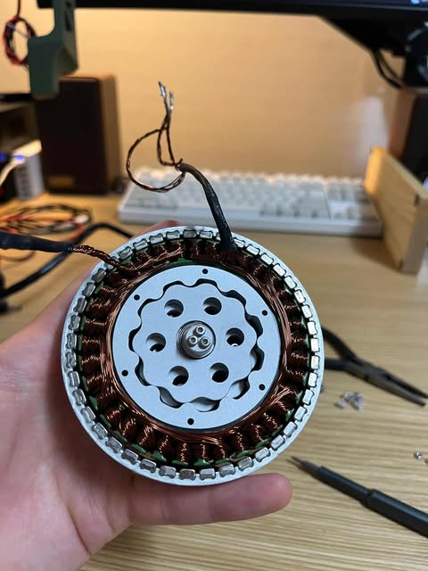</td>
      <td>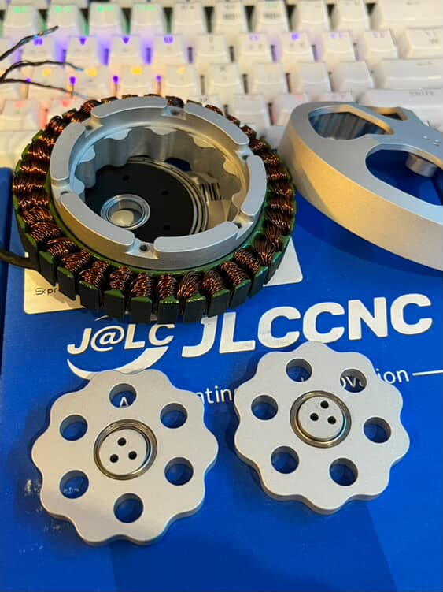</td>
    </tr>
  </table>

### 3.2 Electromagnetic Design (Custom BLDC)

To optimize torque density within the compact housing, I integrated a **custom-built frameless Brushless DC (BLDC) motor** instead of using a standard motor.

For the stator, I utilized a standard 8110 stator core. To achieve the desired current capacity and fill factor, the stator was hand-wound using 0.4mm enameled copper wire. I applied a Wye (Star) termination with 6 parallel strands and 5 turns per tooth, following the optimal winding scheme calculated via open-source tools [[9]](#8-references).

<table>
    <tr>
      <td>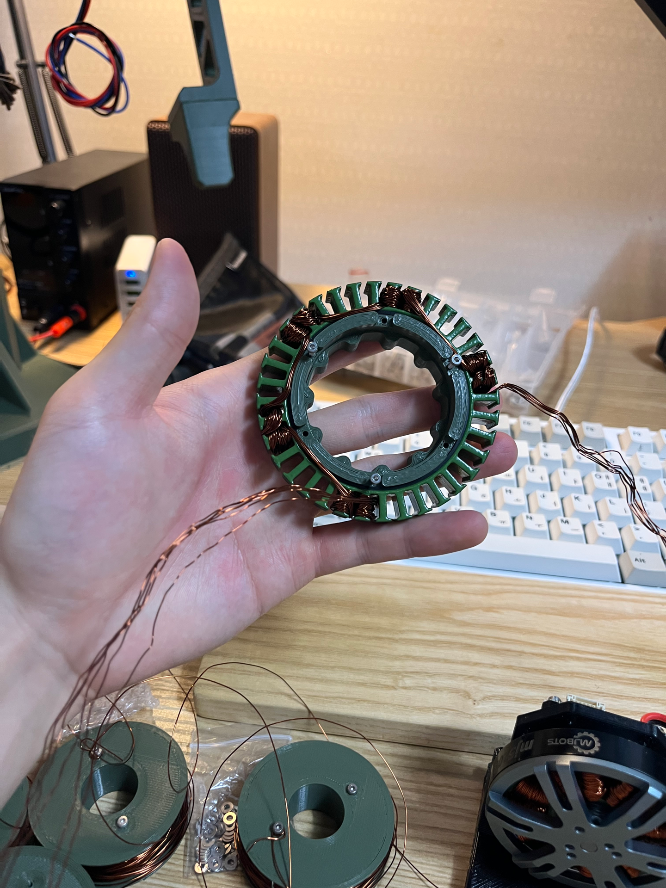</td>
      <td>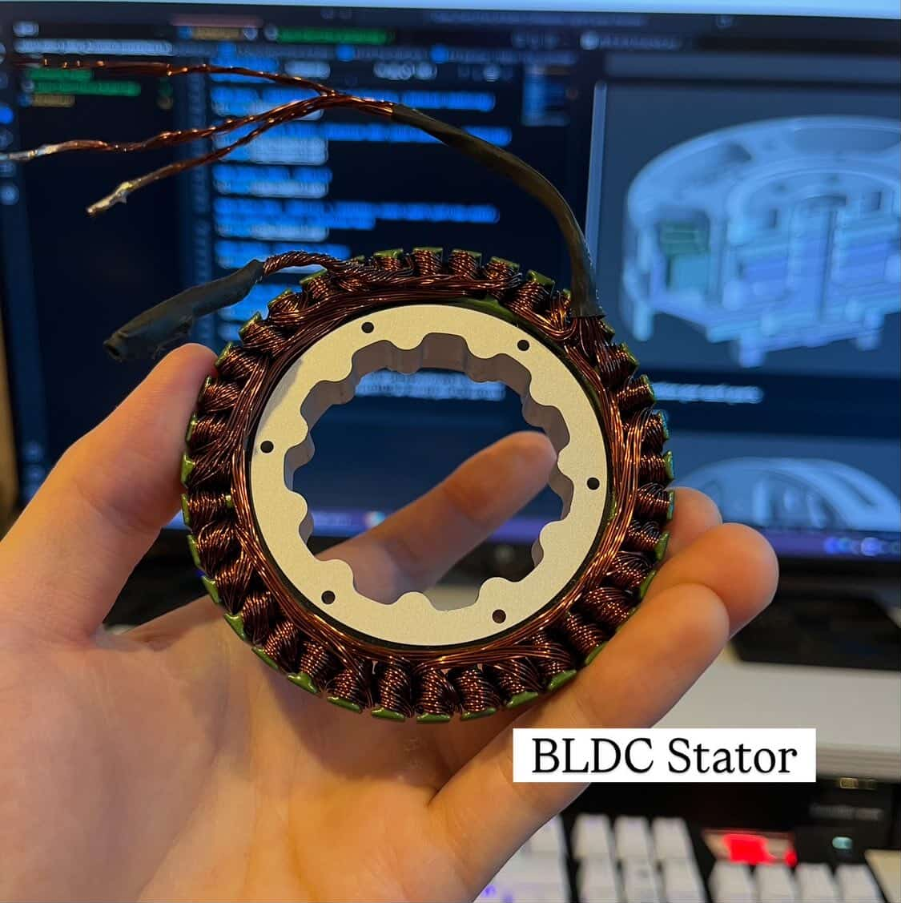</td>
    </tr>
  </table>

The motor adopts a 36N42P configuration (36 slots, 42 poles) to maximize torque output. For the rotor, 42 N52-grade Neodymium magnets were installed. These magnets were precisely bonded using high-strength epoxy (JB Weld) in an alternating polarity pattern (N-S-N-S) to maximize magnetic flux density and ensure structural integrity under high rotation speeds. Crucially, the rotor geometry was optimized to achieve a minimal air gap of 0.5mm. This tight clearance maximizes the magnetic flux linkage between the rotor and stator, thereby significantly enhancing the electromagnetic force and overall torque efficiency.

<table>
    <tr>
      <td>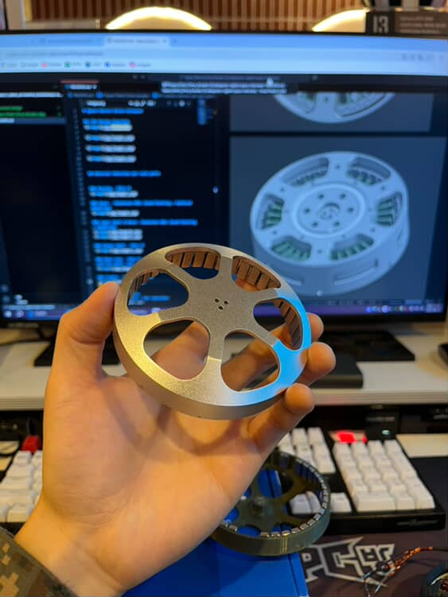</td>
      <td>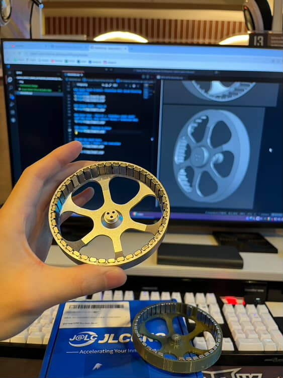</td>
    </tr>
  </table>

### 3.3 Electronics & Sensors
For precise torque control and dynamic response, I integrated the **Moteus-c1 controller** (mjbots). This controller is widely adopted in the dynamic robotics community for its compact form factor and high bandwidth.

It implements **Field Oriented Control (FOC)**, which is essential for smooth torque generation and the proprioceptive capabilities mentioned earlier. With a wide input range (10-51V) and 20A peak phase current, it provides sufficient power capacity to drive the custom-wound 8110 stator to its full potential.

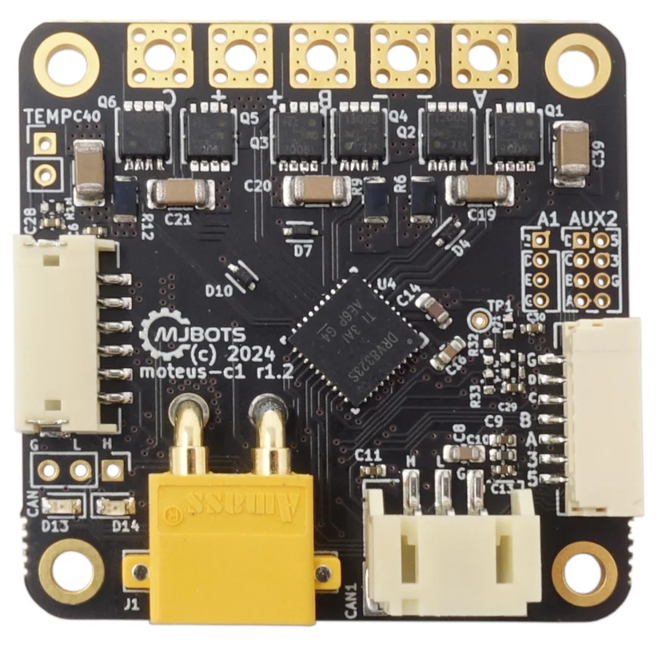
---

## 4. Assembly
Precise assembly is critical to minimize backlash and ensure the longevity of the reducer. I implemented distinct **tolerance strategies** based on the material properties of each component.

### 4.1 Bearing Installation & Fits
For the housing components printed in PA-CF12 (Carbon Fiber Nylon), I designed a 0.1mm interference fit. This accounts for the material's slight compliance and thermal shrinkage during printing, ensuring a secure press-fit without cracking the part.

Conversely, for the CNC-machined Aluminum parts, a tighter 0.02mm interference fit was applied due to the metal's rigidity. To prevent any micro-movements or slippage under high torque loads, I reinforced these metal-to-bearing interfaces with a thin application of JB Weld epoxy.

<table>
    <tr>
      <td>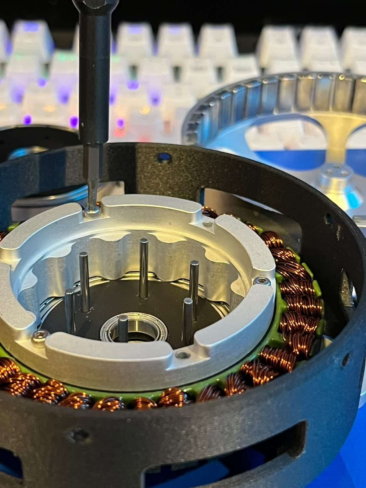</td>
      <td></td>
    </tr>
  </table>

### 4.2 Output Mechanism
The output transmission relies on smooth rolling contact. I installed six M2x20mm stainless steel shafts to serve as the carrier pins. These shafts were precision-aligned to allow the external rollers to rotate freely, minimizing friction at the output stage while maintaining structural rigidity.

---

## 5. Control & Validation
To validate the actuator's performance, I conduct a torque estimation experiment using load-cell. The torque was applied from 1 Nm up to 10 Nm, while performing maximum torque of 8.8Nm. Maximum speed is measured 22rad/s and Nominal speed is 12.6rad/s

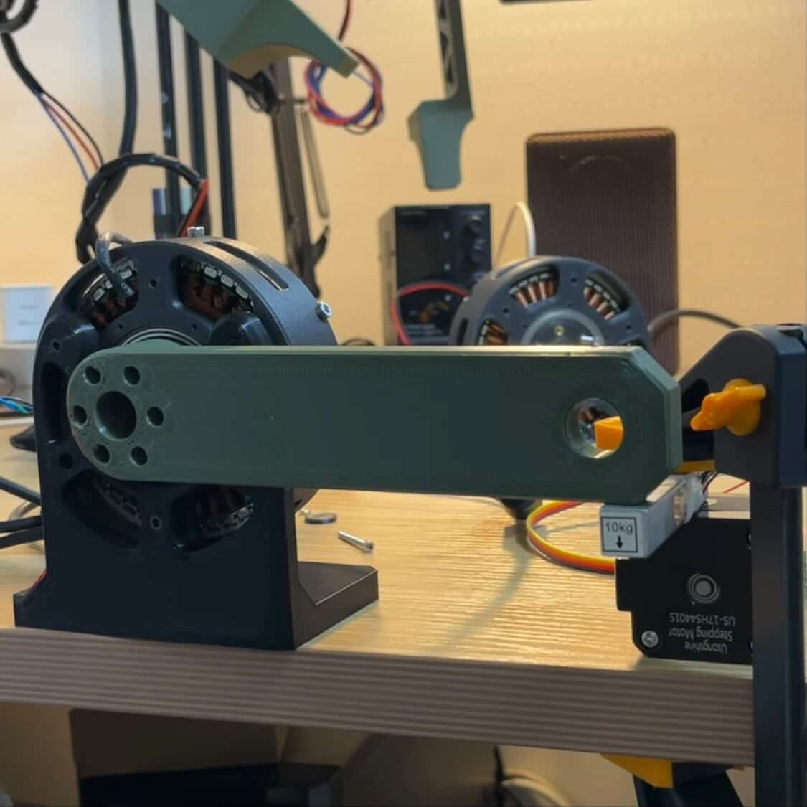

---

## 6. Limitations & Future Works
### 6.1 Limitations of the Current Prototype

Although this first prototype works successfully, four primary limitations were identified regarding the actuator's performance and structural dynamics through the testing and assembly process.

- Rotor Shaft Rigidity(misalignment issue): > The current aluminium rotor shaft is not a single component, this is constructed as a multi-part assembly fastened with bolts and nuts, rather than a single monolithic part. Consequently, the strong electromagnetic forces between the rotor and stator occasionally cause the central shaft to misalign during rotation, leading to an uneven air gap.

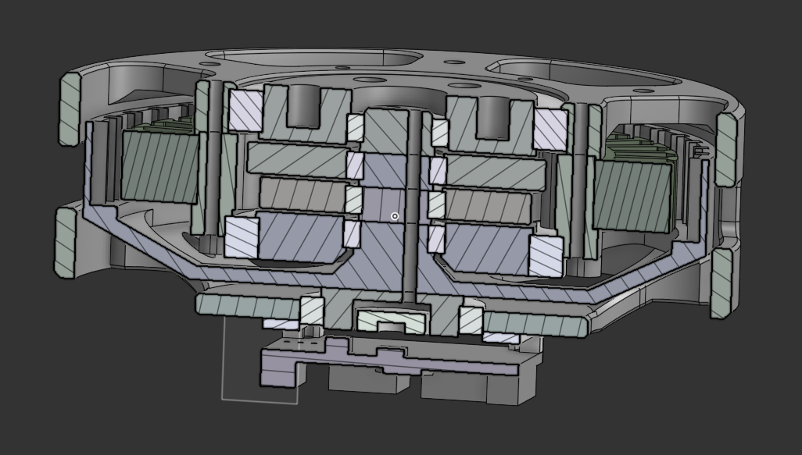

- Absence of a Rotor Back-Iron: > The current rotor design does not incorporate a ferromagnetic back-iron or a Halbach array arrangement. I initially overlooked the critical role of the back-iron which concentrates the magnetic flux inward to maximize magnetic force. Without it, the actuator suffers from flux leakage, resulting in a maximum torque which is insufficient for highly dynamic robotic applications.

- Low Copper Fill Factor: > Since I hand-wound the stator, the copper wires are relatively sparsely packed compared to tightly wound commercial motors. This lower slot fill factor significantly limits the current-carrying capacity and overall torque density.

- Structural Limits for Modularity: >The design of the housing is not suitable for 3d-printed modular actuator. Because the housings are 3D printed, I have to reinforce and modify the design to withstand external mechanical disturbances.

### 6.2 Future Works

Although the first prototype functions adequately, I don't think this prototype is suitable for dynamic robotic systems because of the issues that I mentioned above. Therefore I'm planning to modify the actuator design and improve torque density to achieve successful dynamic robotic actuator in the next iteration (QDD Actuator Ver2)

Moving forward, I aim to integrate these custom QDD actuators into a mid-size bipedal robot and bi-manipulator to validate their performance in a complete system. Those robotic systems strongly require the compliant and dynamic behavior of the QDD Actuator. This project will serve as a crucial step in verifying the scalability of my hardware design while providing a physical testbed for implementing advanced locomotion control algorithms and manipulation tasks.

---

## 7. Credits
* Design, Engineering and Documentation: [Seo Jin Jeong](https://jeongseojin.github.io/)
* Manufacturing Sponsor: [JLCCNC](https://jlccnc.com/)
* Motor Controller: [Moteus-c1 Controller (mjbots)](https://mjbots.com/products/moteus-c1?pr_prod_strat=e5_desc&pr_rec_id=5a7f102a9&pr_rec_pid=7839892799649&pr_ref_pid=7358414749857&pr_seq=uniform)
* Youtube : [Engineering SeoJin](http://www.youtube.com/@engineeringseojin)
* Instagram : [engineering.seojin_n.n](https://www.instagram.com/engineering.seojin_n.n?utm_source=ig_web_button_share_sheet&igsh=ZDNlZDc0MzIxNw==)

## 8. References

[1] S. Seok et al., "Design Principles for Energy-Efficient Legged Locomotion and Implementation on the MIT Cheetah Robot," in IEEE/ASME Transactions on Mechatronics, vol. 20, no. 3, pp. 1117-1129, June 2015, doi: 10.1109/TMECH.2014.2339013.

[2] T. Zhu, J. Hooks and D. Hong, "Design, Modeling, and Analysis of a Liquid Cooled Proprioceptive Actuator for Legged Robots," in 2019 IEEE/ASME International Conference on Advanced Intelligent Mechatronics (AIM), Hong Kong, China, 2019, pp. 36-43, doi: 10.1109/AIM.2019.8868596.

[3] P. M. Wensing, A. Wang, S. Seok, D. Otten, J. Lang and S. Kim, "Proprioceptive Actuator Design in the MIT Cheetah: Impact Mitigation and High-Bandwidth Physical Interaction for Dynamic Legged Robots," in IEEE Transactions on Robotics, vol. 33, no. 3, pp. 509-522, June 2017, doi: 10.1109/TRO.2016.2640183.

[4] J. Tan et al., "Sim-to-Real: Learning Agile Locomotion for Quadruped Robots," in Proc. Robotics: Science and Systems (RSS), 2018, arXiv:1804.10332.

[5] MIT Biomimetics Robotics Lab, "Proprioceptive Actuator Design," biomimetics.mit.edu. [Online]. Available: https://biomimetics.mit.edu/research/1a9ba04b-d200-4743-b8fc-bf231f3231f0. [Accessed: Jan. 23, 2026].

[6] J. W. Sensinger, "Unified Approach to Cycloid Drive Profile, Stress, and Efficiency Optimization," ASME Journal of Mechanical Design, vol. 132, no. 2, p. 024503, Feb. 2010, doi: 10.1115/1.4000832.

[7] K. Lee, S. Hong, and J. H. Oh, "Development of a Lightweight and High-efficiency Compact Cycloidal Reducer for Legged Robots," International Journal of Precision Engineering and Manufacturing, vol. 21, no. 1, pp. 63-71, Jan. 2020, doi: 10.1007/s12541-019-00215-9.

[8] J. W. Sensinger and J. H. Lipsey, "Cycloid vs. Harmonic Drives for Use in High Ratio, Single Stage Robotic Transmissions," in 2012 IEEE International Conference on Robotics and Automation (ICRA), Saint Paul, MN, USA, 2012, pp. 4130-4135, doi: 10.1109/ICRA.2012.6224739.

[9] "Homebuilt Electric Motors - Calculator," bavaria-direct.co.za. [Online]. Available: https://www.bavaria-direct.co.za/scheme/calculator/. [Accessed: Jan. 23, 2026].

